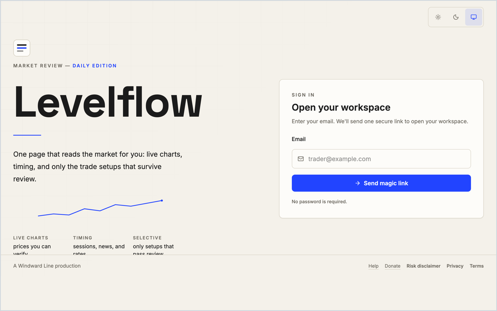

# Levelflow Cloud

Live: **[levelflow.windwardline.com](https://levelflow.windwardline.com)**



Levelflow Cloud is a Windward Line production: a React/Vite and Supabase platform for disciplined market review, chart analysis, and limit-order setup generation. The app uses Supabase Auth, strict user-owned data tables with RLS, server-side market data, an Edge Function analyzer, and a focused web workspace for logged-in users.

## What holds it

- **User-owned data by construction.** Row-level security on all fourteen tables — own-row CRUD on user tables, read-only shared reference data — enforced in the database, so a client bug cannot leak another user's records ([supabase/init.sql](/supabase/init.sql)).
- **Fail-closed, and tested for it.** The analyzer refuses ambiguity rather than reinterpreting it: missing auth 401, unrecognized action 400, over-budget 429 with an audit row. Rate-limit tables and the claim function are revoked from every user role, and [tests/securityHardening.test.ts](/tests/securityHardening.test.ts) asserts each grant line — a privilege regression is a red build.
- **Auditable to the exact build.** Append-only `analyzer_events` records actor, action, outcome, latency, and the bundle stamp of the code that served the request; rows age out after a stated 60-day retention window, pruned in bounded, counted batches (never silently).
- **No plausible numbers.** A financial figure enters by exactly three routes — the broker publishes it, Levelflow derives it by a published method, or the owner observes it live and records it dated and attributed. Where the routes run out, the interface renders a word instead of a number, and that refusal is the feature working.
- **A design system defended by CI.** Roughly 2,200 automated tests include every text pair's WCAG contrast ratio in both themes ([tests/contrast.test.ts](/tests/contrast.test.ts)), the design-token contract, a motion-law census, and a language guard that pins rendered strings bidirectionally to the spec.

## Architecture

- `public/brand/` contains the Levelflow mark in both themes; the favicon set, manifest, and og-image live at the `public/` root. Run `node scripts/render-brand-assets.mjs` to regenerate all of them from the app's colour tokens.
- `src/` contains the React application, Supabase client, passwordless/OAuth login, advisor workspace, profile preferences, history, donation options, the legal document surface, and charting components.
- `public/legal/` holds the three published documents — risk disclaimer, privacy, terms — as static HTML. They are what direct links, search engines, and signed-out readers land on. Inside the app the same documents open as a surface, rendered from `src/lib/legalDocuments.ts`, which owns their prose; a guard holds the static files to that module in both directions so the two presentations cannot drift. Links follow the three tiers in spec §17o: in-app destinations switch surfaces, our own documents present in-frame, and only true externals open a new tab.
- `supabase/functions/` contains the production backend: authenticated market data, trade analysis, calendar ingestion, and scheduled outcome-resolution Edge Functions.
- `supabase/` contains the SQL bootstrap, launch migrations, RLS policies, Realtime setup, and Edge Functions.
- `.env.example` separates public browser keys from server-only service-role credentials.

## Local Commands

```bash
npm install
npm run dev
npm run lint
npm test
npm run test:e2e
npm run build
```

Run `supabase/init.sql` in the Supabase SQL editor or through your migration workflow before using a fresh project.

## Continuous Integration and Deployment

`ci.yml` runs typechecks (app, node, and the tests/scripts graph), lint, unit
tests, `npm audit`, the migrations check, the build, and the bundle budget on
every push and pull request to `main`.

`deploy.yml` runs on a push to `main`: the frontend build gate first, then
Supabase migrations, Edge Function deploys, and browser tests. Vercel builds
and deploys the frontend directly from this repo on the same push
(`vercel.json` sets the framework, build command, and security headers; the
build command type-checks the whole graph, tests and scripts included, so a
test type error fails the production build too) and serves it at
[levelflow.windwardline.com](https://levelflow.windwardline.com). The Vercel
build runs independently of `deploy.yml`, so a frontend that depends on a new
migration should land one push after the migration.

A tab that was open when a deploy landed says so: the signed-in shell compares the
bundle it is running against the one `/` now serves and offers a reload in the
masthead. Every analyzer request also names its own bundle, which the analyzer
records in `analyzer_events`. See [docs/deployment.md](/docs/deployment.md).

## Production Checklist

1. Create or select a Supabase project.
2. Run [supabase/init.sql](/supabase/init.sql) in the Supabase SQL editor.
3. In Supabase Auth, enable email OTP/magic links and configure Google/Apple OAuth providers.
4. Add `https://levelflow.windwardline.com/` and any fallback/local development URLs to Supabase Auth redirect URLs.
5. Apply the launch migrations in `supabase/migrations/`.
6. Deploy the Supabase Edge Functions and set Supabase function secrets:
   - `NEWS_SYNC_TOKEN`
   - `FMP_API_KEY` for the analyzer and macro news ingestion
   - `FINNHUB_API_KEY` only if macro news ingestion is switched away from FMP
   - `FMP_API_BASE_URL` only if FMP changes the default stable REST host
7. Set hosted frontend env vars:
   - `VITE_APP_URL`
   - `VITE_SUPABASE_URL`
   - `VITE_SUPABASE_PUBLISHABLE_KEY`
8. Keep these server-only values out of static hosting:
   - `SUPABASE_SERVICE_ROLE_KEY`
   - `NEWS_SYNC_TOKEN`
   - `FMP_API_KEY`
   - `FINNHUB_API_KEY`

Market-data and economic-calendar keys must be used from a server runtime or edge function, not from browser JavaScript. Levelflow does not place trades; trade execution is outside the active product scope.

See [docs/trade-model.md](/docs/trade-model.md) for the engine state of record, and **[docs/research/remediation-program-2026-08-11.md](/docs/research/remediation-program-2026-08-11.md) before trusting any calibration figure** — an audit on 2026-08-11 found the replay corpus behind the current per-market cells resolved every setup 4–5 hours out of register with its own decision bar, so its expectancy figures are artifacts and the calibration is being rebuilt from the clock up. The desk is parked while that work runs.
See [docs/design/contrast.md](/docs/design/contrast.md) for every text pair's measured WCAG ratio in both themes, enforced by `tests/contrast.test.ts`.
See [docs/security-hardening.md](/docs/security-hardening.md) for the Cloudflare response-header policy and authenticated E2E test-user setup.
See [docs/gap-analysis.md](/docs/gap-analysis.md) for the current improvement backlog across trade logic, frontend, backend, security, and reliability.
